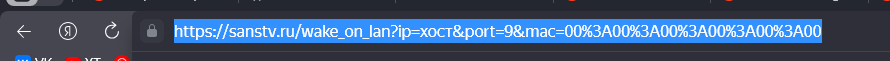

# Настраиваем включение и выключение компьютера с помощью Алисы

Видеогайд с полной инструкцией: ***

# Этап 1: Проверка, что ваши железки подходят

### Белый или серый IP

Самый важный этап проверки — это проверка вашего IP, нужно узнать, белый у вас IP или серый (спойлер: с серым ничего не получится).

Проверить IP можно по этому гайду: [ТЫК](https://skillbox.ru/media/)

Либо можете проверить в личном кабинете вашего провайдера (написано не у всех, но гарантированный вариант — позвонить на горячую линию оператора).

### Настройки роутера

Нужно проверить, умеет ли ваш роутер совершать переадресации портов. Это нужно, чтобы запускаемая программа для выключения ПК могла получать запросы из глобального интернета (Алиса, увы, не умеет работать с локальной сетью, а очень хотелось бы <b>ЯНДЕКС!</b>).

Как показывает моя практика, ВСЕ роутеры умеют совершать переадресации портов, даже мой старющий <i>NETGEAR WNR612</i> такое умеет.


Панель управления роутером открывается [тут](http://192.168.1.1/), или если не сработало [вот тут](http://192.168.1.0/).

### Проверка вашей материнской платы на наличие Wake on Lan

Эта технология нужна для включения ПК, если у вас такой технологии нет, то вы всё равно сможете настроить выключение ПК.

Проверьте наличие WoL по этому гайду: [ТЫК](https://winitpro.ru/index.php/2023/11/29/wake-on-lan-v-windows/).

Если лень читать, но руки из ровного места, ищите в BIOS пункт Wake on Lan или ему подобные (насколько знаю, у Lenovo эта технология называется чуть иначе) и включайте.

# Этап 2: Настраиваем Алису

### Настраиваем включение ПК по Wake on Lan

Первым делом нам нужно узнать наш IP и MAC адрес.

Узнаем наш IP через сайт [2ip](https://2ip.ru/).


Записываем куда-нибудь ваш IP и идём дальше.

Теперь наша задача — узнать MAC адрес вашего ПК, делать мы это будем через командную строку: жмем на клавиатуре <b>WIN + R</b>, вводим в открывшееся окно <b>CMD</b> и жмем Enter. В открывшийся терминал вписываем <b>ipconfig /all</b>.


Ищем физический адрес и IPv4 адрес, также куда-нибудь записываем их.

Всё, со страшными терминалами мы закончили. Теперь нужно зайти на [этот сайт](https://sanstv.ru/wake_on_lan).


Заполняем всё по инструкции с картинки, и после заполнения жмём на "отправить". Как только снизу появится сообщение об отправке, жмём на адресную строку и копируем адрес.



Теперь наступает самый муторный и странный этап — нам нужно настроить навык для Алисы под названием <b>Домовёнок Кузя</b>.

Заходим на сайт и авторизуемся через Яндекс:


После авторизации ищем зелёную кнопку <b>Добавить правило HTTP (GET)</b> и жмём на неё.


В созданном нами правиле сначала вводим URL, который мы скопировали, а после вводим активационную фразу, иначе сайт выдаст ошибку и ничего не сохранит.

Сразу же, не отходя от кассы, создаём второе правило и аналогично вводим туда следующие параметры:

Активационная фраза: <b>Выключи компьютер</b> (либо на ваш вкус).

URL: <b>http://0.0.0.0:9090/shutdown</b> (вместо 0.0.0.0 вводим ваш IP, взятый с 2ip).

С настройкой запросов мы закончили, теперь ищем кнопочку <b>Виртуальные устройства умного дома</b> и жмём на неё.


На открывшейся странице создаём новое устройство с типом <b>Выключатель</b>.


Называем наше новое устройство <b>Компьютер</b> и задаём все параметры аналогично тем, что на скриншоте ниже.


Теперь переходим в приложение <b>Дом с Алисой</b> и добавляем новое устройство (плюсик справа сверху), <b>выбираем Устройство умного дома</b>.


В открывшемся окне ищем <b>Домовёнок Кузя</b> и добавляем его.


Пройдите базовую настройку Домовёнка Кузи, как это сделать я уже не буду расписывать, там всё очевидно и понятно :)

Ну и всё, теперь заключительный этап настройки Алисы — заходим в панель управления роутером [жмём сюда](http://192.168.1.1/), или если не сработало [сюда](http://192.168.1.0/).

Ищем настройку с переадресацией портов и настраиваем (поскольку у всех роутеров интерфейсы разные, я не буду показывать всё через картинки).


Всё сводится к тому, что нам нужно создать 2 службы, назвать их можно как угодно, я для удобства назвал их WoL и WoL Shutdown.
В поле IP нужно ввести IPv4 адрес, который мы копировали из консоли, отличаться будет только последняя цифра.

В начальный и конечный порт вводим: 

для 1 правила — 9 и 9

для 2 правила — 9090 и 9090

Также выбираем TCP/UDP протокол (если есть возможность).

После создания служб можно сказать, что всё — вы огромные молодцы, ведь сделали самую сложную часть настройки, ваш ПК уже может включаться. Осталось лишь настроить его выключение и помолиться, что всё сработает после 3 этапа настройки :)

# Этап 3: Настройка вашего ПК на выключение

### Скачиваем и настраиваем программу

ПЕРЕД УСТАНОВКОЙ УСТАНОВИТЕ: [NodeJS](https://nodejs.org/) и [Microsoft .NET Framework 4](https://www.microsoft.com/ru-RU/download/details.aspx?id=17718), без них программа не будет работать!

Чтобы Алиса могла выключать ваш ПК, нужно настроить программу. Скачать её можно по ссылке [вот по этой вот](https://github.com/ShizzaHo/AlisaShutdownPC/releases), разройте пункт Assets и скачайте .zip архив.


Распакуйте архив в удобное место (лучше куда-то подальше от рабочего стола, ведь нам потом эту программу в автозапуск настраивать).


Создайте ярлык на .exe файл и скопируйте/вырежьте его.

Дальше нам нужно зайти в папку автозапуска: жмем на клавиатуре <b>WIN + R</b>, вводим в открывшееся окно <b>shell:startup</b> и жмем Enter.

Перед нами открывается папка, в которой находится всё, что будет запускаться при запуске ПК, вам нужно вставить в неё созданный нами ранее ярлык.

Теперь можно запускать программу, и... всё!

Можете проверить ваш ПК на выключение и включение, сказав Алисе: <b>Алиса, включи/выключи компьютер</b>.

# Информация для неравнодушных

Поддержать за проделанную работу: [DONATIONALERTS](https://www.donationalerts.com/r/shizzaho)

# Информация для разработчиков

### NodeJS Invisible

Весь проект находится под крылом этого инструмента. Это ещё один мой репозиторий, который позволяет запускать NodeJS в фоновом режиме без активных окон и т.д., если интересно: [вам сюда](https://github.com/ShizzaHo/NodeJS-Invisible).

### ExpressJS

Вся серверная часть работает на этой библиотеке.

### Установка для разработки и доработки

Всё по классике: ```npm i```, ```npm start```.

### Никаких лицензий нет

Используйте как хотите, но буду благодарен, если отметите как первоначального автора или как автора идеи.