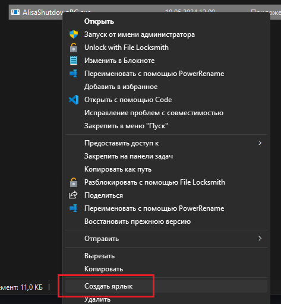

# Настраиваем включение и выключение компьютера с помощью алисы

Видеогайд с полной инструкцией: ***

# Этап 1: Проверка что ваши железки подходят

### Белый или серый IP

Самый важный этап проверки это проверка вашего IP, нужно узнать белый у вас IP или серый (спойлер: с серым ничего не получится)

Проверить IP можно по этому гайду: [ТЫК](https://skillbox.ru/media/)

Либо можете проверить в личном кабинете вашего провпайдера (написано не у всех, но гарантированный вариант позвонить на горячую линию оператора)

### Настройки роутера

Нужно проверить умеет ли ваш роутер совершать переадресации портов, это нужно чтобы запускаемая программа для выключения ПК могла получать запросы из глобального интернета (Алиса увы, не умеет работать с локальной сетью, а очень хотелось бы <b>ЯНДЕКС!</b>)

Как показывает моя практика ВСЕ роутеры умеют совершать переадресации портов, даже мой старющий <i>NETGEAR WNR612</i> такое умеет


Панель управления роутером открываемся [тут](http://192.168.1.1/), или если не сработало [вот тут](http://192.168.1.0/)

### Проверка вашей материнской платы на наличие Wake of Lan

Эта технология нужна для включения ПК, если у вас такой технологии нет, то вы все равно сможете настроить выключение пк

Проверьте наличие WoL по этому гайду: [ТЫК](https://winitpro.ru/index.php/2023/11/29/wake-on-lan-v-windows/) 

Если лень читать, но руки из ровного места, ищите в биосе пункт Wake Of Lan или ему подобные (насколько знаю у леново эта технология называется чуть иначе) и включайте

# Этап 2: Настраиваем Алису

### Настраиваем включение ПК по Wake of Lan

Первым делом нам нужно узнать наш IP и MAC адрес

Узнаем наш IP через сайт [2ip](https://2ip.ru/)


Записываем куда-нибудь ваш IP и идем дальше.

Теперь наша задача узнать MAC адрес вашего пк, делать мы это будем черещ командную строку: жмем на клавиатуре <b>WIN + R</b> вводим в открывшееся окно <b>CMD</b> и жмем Enter. В открывшийся терминал вписываем <b>ipconfig /all</b>


Ищем физический адрес и IPv4 адрес, так-же куда-нибудь записываем их

Все, с страшными терминалами мы закончили, теперь нужно зайти на [этот сайт](https://sanstv.ru/wake_on_lan)


Заполняем все по инструкции с картинки, и после заполнения жмем на отправить, как только снизу появится сообщение об отправке, жмем на адрессную строку и копируем адресс


Теперь наступает самый муторный и странный этап, нам нужно настроить навык для алисы под названием <b>домовенок кузя</b>

Заходим на сайт и авторизуемся через Яндекс:


После авторизации ищем зеленую кнопку <b>Добавить правило HTTP (GET)</b> и жмем на нее


В созданном нами правиле, сначала вводим URL который мы скопировали, а после вводим активационную фразу, иначе сайт выдаст оишбку и ничего не сохранит.

Сразу же не отходя от кассы создаем второе правило и аналогично вводим туда следующие параметры:

Активационная фраза: <b>Выключи компьютер</b> (Либо на ваш вкус)

URL: <b>http://0.0.0.0:9090/shutdown</b> (Вместо 0.0.0.0 вводим ваш IP взятый с 2ip)

С настройкой запросов мы закончили, теперь ищем кнопочку <b>Виртуальные устройства умного дома</b> и жмем на нее


На открывшейся странице создаем новое устройство с типом <b>Выключатель</b>


Называем наше новое устройство <b>Компьютер</b> и задаем все параметры аналогично тем что на скриншоте ниже


Теперь переходим в приложение <b>дом с алисой</b> и добавляем новое устройство (плюсик справа сверху), <b>выбираем Устройство умного дома</b>


В открывшемся окне ищем <b>домовенок кузя</b>, и добавляем его


Пройдите базовую настройку домовенка кузи, как это сделать я уже не буду расписывать, там все очевидно и понятно :)

Ну и все, теперь заключительный этап настройки Алисы, заходим в панель управления роутером [жмем сюда](http://192.168.1.1/), или если не сработало [сюда](http://192.168.1.0/)

Ищем настройку с переадресацией портов и настраиваем (поскольку у всех роутеров интерфейсы разные, я не буду показывать все через картинки)


Все сводится к тому что нам нужно создать 2 службы, назвать их можно как угодно, я для удобства назвал их WoL и WoL Shutdown.
В поле IP нужно ввести IPv4 адрес который мы копирвоали из консоли, отличаться будет только последняя цифра.

В начальный и конечный порт вводим: 

для 1 правила - 9 и 9

для 2 правила - 9090 и 9090

Также выбираем TCP/UDP протокол (если есть возможность)

После создания служб можно сказать что все, вы огромные молодцы ведь сделали самую сложную часть настройки, ваш ПК уже может включаться. Осталось лишь настроить его выключение и помолиться что все сработает после 3 этапа настройки)))

# Этап 3: Настройка вашего ПК на выключение

### Скачиваем и настраиваем программу

ПЕРЕД УСТАНОВКОЙ УСТАНОВИТЕ: [NodeJS](https://nodejs.org/) и [Microsoft .NET Framework 4](https://www.microsoft.com/ru-RU/download/details.aspx?id=17718), без них программа не будет работать!

Чтобы алиса могла выключать ваш пк нужно настроить программу, скачать ее можно по ссылке [вот по этой вот](https://github.com/ShizzaHo/AlisaShutdownPC/releases), расройте пункт Assets, и скачайте .zip архив


Распакйте архив в удобное место (лучше куда-то подальше от рабочего стола, ведь нам потом эту программу в автозапуск настраивать)



Создайте ярлык на .exe файл, и скопируйте/вырежте его

Дальше нам нужно зайти в папку автозапуска: жмем на клавиатуре <b>WIN + R</b> вводим в открывшееся окно <b>shell:startup</b> и жмем Enter.

Перед нами октрывается папка в которой находится все что будет запускаться при запуске ПК, вам нужно вставить в него созданный нами ранее ярлык.

Теперь можно запускать программу, и... все!

Можете проверить ваш пк на выключение и включение сказав Алисе: <b>Алиса, включи/выключи компьютер</b>.

# Информация для неравнодушных

Поддержать за проделанную работу: [DONATIONALERTS](https://www.donationalerts.com/r/shizzaho)


# Информация для разрабов

### NodeJS Invisible

Весь проект находится под крылом этого инстурмента. Это еще один мой репозиторий который позволяет запускать NodeJS в фоновом режиме без активных окон и тд, если интересно: [вам сюда](https://github.com/ShizzaHo/NodeJS-Invisible).

### ExpressJS

Вся серверная часть работает на этой либе

### Установка для разработки и доработки

Все по классике: ```npm i```, ```npm start```

### Никаких лицензий нет

Используйте как хотите, но буду благодароен если отметите как первоначального автора или как автора идеи